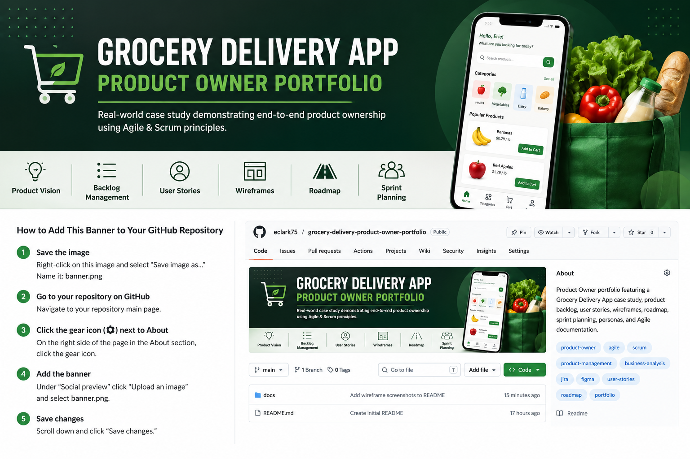

# Grocery Delivery Product Owner Portfolio

This repository contains my Product Owner portfolio project, including product vision, user stories, backlog management, wireframes, roadmap, personas, sprint planning, and case study documentation.
---

## 📂 Portfolio Contents

- 📋 Product Vision
- 👤 User Personas
- 📝 Product Backlog
- ✅ User Stories
- 🗺️ Product Roadmap
- 📅 Sprint Planning
- 🎨 Figma Wireframes
- 📖 Case Study

---

## 🛠 Tools Used

- Jira
- Confluence
- Figma
- GitHub
- Google Docs
- Google Sheets

---

## Skills Demonstrated

- Product Ownership
- Agile Scrum
- Backlog Management
- User Story Writing
- Acceptance Criteria
- Sprint Planning
- Roadmapping
- Wireframing
- Stakeholder Communication
